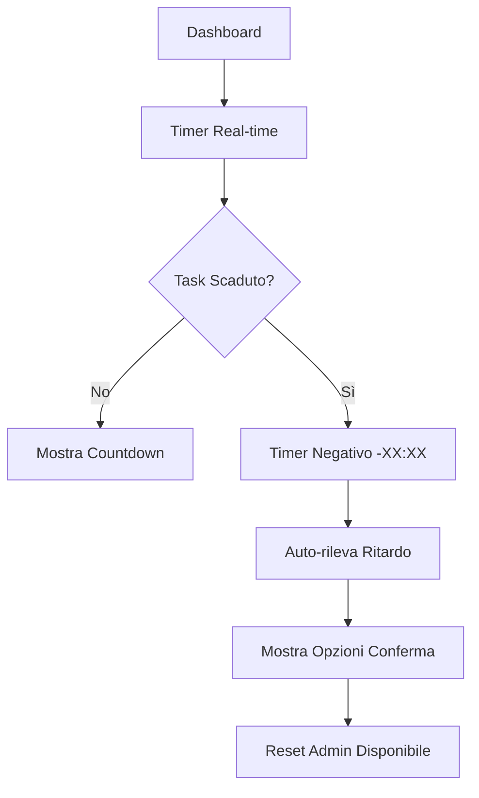

# 📋 README - WorkRouteOptimizer

## 🎯 Descrizione
**WorkRouteOptimizer** è un'applicazione web per la gestione intelligente di schedule di lavoro con monitoraggio in tempo reale dei task e gestione automatica dei ritardi.

## ⚡ Avvio Rapido

### Windows
```powershell
# 1. Installa Node.js da https://nodejs.org/
# 2. Clona/scarica il progetto
# 3. Installa dipendenze
npm install

# 4. Avvia applicazione
npm run dev
```

🌐 **Apri**: http://localhost:3000

### Documentazione Completa
📖 **[Guida Installazione Windows](./INSTALLAZIONE_WINDOWS.md)**

---

## 🎮 Funzionalità Principali

### ⏰ Timer Intelligente
- **Countdown normale**: Verde → Arancione (ultimi 10 min)
- **Timer negativo**: Rosso, conta ritardo: -01:00, -02:00...
- **Aggiornamento real-time**: Ogni secondo

### 🔄 Gestione Ritardi
- **Segnalazione semplice**: Solo marca ritardo, non modifica orari
- **Conferma flessibile**: Permetti conferma anche in ritardo
- **Auto-rilevamento**: Sistema rileva ritardi automaticamente

### 🛡️ Reset Amministratore
- **Password protetto**: Default `admin123`
- **Reset intelligente**: Rimuove solo ritardi, mantiene schedule
- **Conferma automatica**: Solo task nel passato

### 🎨 UI/UX
- **Dashboard responsive**: Ottimizzato per desktop e mobile
- **Indicatori visivi**: Colori e icone intuitive
- **Feedback immediato**: Stato task sempre visibile

---

## 🏗️ Architettura

### Frontend (React + TypeScript)
- **Framework**: React 18 con TypeScript
- **State Management**: TanStack Query per caching e sync
- **UI Components**: Shadcn/ui (Radix primitives)
- **Styling**: Tailwind CSS

### Backend (Node.js + Express)
- **Server**: Express.js con TypeScript
- **Validazione**: Zod schemas
- **Storage**: In-memory (espandibile a database)
- **API**: RESTful endpoints

### Shared
- **Schemas**: Zod per validazione client/server
- **Types**: TypeScript interfaces condivise

---

## 📊 Flusso Applicazione



---

## 🔧 Scripts Disponibili

```json
{
  "dev": "Avvia server sviluppo",
  "build": "Compila per produzione", 
  "start": "Avvia server produzione",
  "lint": "Controllo codice ESLint",
  "type-check": "Verifica TypeScript"
}
```

---

## 🗂️ Struttura Progetto

```
📁 WorkRouteOptimizer/
├── 📁 client/                    # Frontend React
│   ├── 📁 src/
│   │   ├── 📁 components/        # Componenti UI
│   │   │   ├── CountdownTimer.tsx      # Timer con negativo
│   │   │   ├── CurrentTaskCard.tsx     # Card task principale
│   │   │   ├── ResetDelayDialog.tsx    # Dialog reset admin
│   │   │   └── 📁 ui/                  # Componenti base UI
│   │   ├── 📁 pages/
│   │   │   └── Dashboard.tsx           # Pagina principale
│   │   └── 📁 hooks/                   # Custom React hooks
│   └── 📄 index.html
├── 📁 server/                    # Backend Express
│   ├── 📄 index.ts              # Server principale
│   ├── 📄 routes.ts             # API endpoints
│   ├── 📄 storage.ts            # Gestione dati
│   └── 📄 scheduleGenerator.ts  # Generazione schedule
├── 📁 shared/                   # Codice condiviso
│   └── 📄 schema.ts             # Zod schemas
├── 📄 package.json              # Dipendenze e scripts
├── 📄 tsconfig.json             # Config TypeScript
├── 📄 vite.config.ts            # Config Vite
└── 📄 INSTALLAZIONE_WINDOWS.md  # Guida installazione
```

---

## 🌟 Caratteristiche Avanzate

### Timer Negativo
```typescript
// Timer continua dopo zero
timeLeft = -180; // -3 minuti
display = "-03:00"; // Formato negativo
color = "text-destructive"; // Rosso
label = "In ritardo da"; // Label dinamica
```

### Reset Intelligente
```typescript
// Solo task nel passato vengono confermati
if (currentTime > taskEndTime && status === "pending") {
  confirmTask(); // Auto-conferma
}
```

### Gestione Stati
- `pending`: Task da confermare
- `confirmed`: Task completato
- `delayed`: Task in ritardo
- `missed`: Task perso

---

## 🔒 Configurazione

### Variabili Ambiente (.env)
```env
# Password amministratore
ADMIN_PASSWORD=tuaPasswordSegreta

# Porta server
PORT=3000

# Modalità debug
DEBUG=false
```

### Personalizzazioni
- **Password admin**: Modifica in `.env`
- **Intervalli timer**: Configurabili in `CountdownTimer.tsx`
- **Soglie urgenza**: Personalizzabili (default: 10 minuti)

---

## 🚀 Deploy Produzione

### Build
```bash
npm run build
```

### Avvio Produzione
```bash
npm start
```

### Considerazioni
- **Database**: Implementare per persistenza dati
- **Autenticazione**: Sistema login completo
- **HTTPS**: Certificati SSL per produzione
- **Monitoring**: Log e metriche applicazione

---

## 🤝 Contributi

### Sviluppo
1. Fork del repository
2. Crea branch feature: `git checkout -b feature/nuova-funzionalita`
3. Commit modifiche: `git commit -m "Aggiunge funzionalità X"`
4. Push branch: `git push origin feature/nuova-funzionalita`
5. Apri Pull Request

### Bug Report
Usa GitHub Issues per segnalare problemi, includendo:
- Versione Node.js
- Sistema operativo
- Passi per riprodurre
- Log errori

---

## 📄 Licenza

MIT License - Vedi file LICENSE per dettagli

---

## 📞 Supporto

- **Documentazione**: [INSTALLAZIONE_WINDOWS.md](./INSTALLAZIONE_WINDOWS.md)
- **Issues**: GitHub Issues
- **Email**: [Inserire email supporto]

---

**🎯 WorkRouteOptimizer v1.0** - Gestione intelligente schedule di lavoro